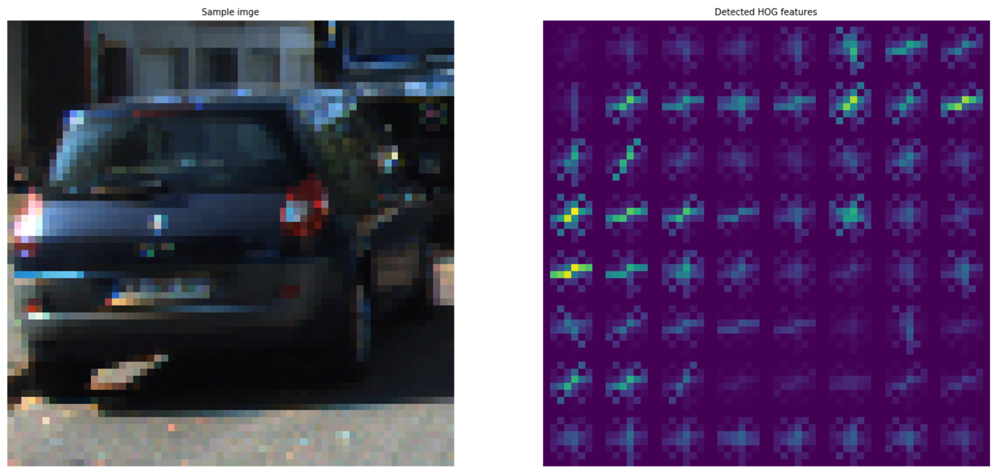
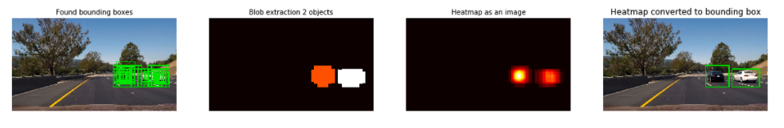
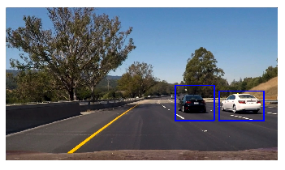

# Vehicle Detection Project

The goals / steps of this project are the following:

* Perform a Histogram of Oriented Gradients (HOG) feature extraction on a labeled training set of images and train a Linear SVM classifier
* Optionally, you can also apply a color transform and append binned color features, as well as histograms of color, to your HOG feature vector.
* Normalize your features and randomize a selection for training and testing.
* Implement a sliding-window technique and use your trained classifier to search for vehicles in images.
* Run your pipeline on a video stream (start with the test_video.mp4 and later implement on full project_video.mp4) and create a heat map of recurring detections frame by frame to reject outliers and follow detected vehicles.
* Estimate a bounding box for vehicles detected.

---
Notes:

The accompanying Jupyter Notebook `Vehicle Detection.ipynb` contains the code for this project and is used for testing various configuration options.
The classes `ImageFeatureExtractor` and `ObjectDetector` have additionally been copied into their own python files so that they can be used elsewhere.
The python scripts `train.py` and `process.py` uses these classes to perform the training and pipeline processing outside of the notebook as I was getting out-of-memory issues processing the larger video files in Jupyter.

## Feature Extraction - Histogram of Oriented Gradients (HOG)
In cell 2 of the notebook I have defined the `ImageFeatureExtractor` class. This class is instantiated with a list of configuration options for feature extraction.
Method `extract_features` does the hard work and performs the following steps:
- Colour-space conversion. Allows for conversion to one of the OpenCV supported colour spaces.
- Extract spatial features. Extract features by collecting colour spatial information (per channel) and concatenating to form a feature vector.
- Extract colour histograms. Using `np.histogram` we compute histograms for each image channel and then concatenate them together to form the features.
- Extract HOG features. The `skimage.feature.hog` function is used here to extract features per image channel. Based on the provided config (setup in cell 3). It allows us to extract features on an individual channel of choice or across all channels.

The results of each of the above feature extraction techniques is then concatenated together to form one long feature vector at the end of method `extract_features`.

I started by reading in all the `vehicle` and `non-vehicle` images.  Here is an example of one of each of the `vehicle` and `non-vehicle` classes:

The main technique here is extracting the HOG features. I settled on using the other colour techniques as well but found that they made little difference to the output. Possibly tweaking the parameters here could have achieved a better result. Dealing with blob detection false positives was much more important to the final pipeline and these are discussed further below.

My final configuration options are as follows:
```
feature_config = {
    'color_space' : 'YCrCb',
    'orient' : 9,
    'pix_per_cell' : 8,
    'cell_per_block' : 2,
    'hog_channel' : 'ALL',
    'spatial_size' : (32, 32),
    'hist_bins' : 32,
    'spatial_feat' : True,
    'hist_feat' : True,
    'hog_feat' : True
}
```

Example HOG features:


#### Training a classifier

I trained a linear SVM classifier using the extracted feature vector from each image as can be seen in cell 5 of the notebook.
The steps to train the classifier in this cell include:
- read in all positive images (with cars)
- read in all negative images (without cars)
- instantiate our feature extractor `ImageFeatureExtractor` with our desired config
- Stack the feature vectors together and create our labels
- Use sklearn's `train_test_split` to give us our training and test sets
- Finally instantiate a `LinearSVC`, fit it to our features and test the accuracy.

Note: I found acceptable accuracy with using the default LinearSVM hyper-parameters of greater than 99%.
The code from this cell is replicated into python script `train.py` so that we can train and process our data outside the notebook.

### Sliding Window Search
I have used a sliding window search to scan images for the objects we are looking for. This algorithm is implemented in two stages:
1. Pyramid search or scale search - this is where we slide our windows across the image at different scales. This enables us to detect objects that can be varying sizes. With this dataset the objects are cars, which are typically smaller as they get farther away. See the code in method `process` of class `ObjectDetector` (Cell 2 of the notebook) where it calls `get_pyramid_windows`. This method in-turn calls method `get_sliding_windows` passing it a different scale (or image size) on each iteration. `get_sliding_windows` returns an array of window points (rectangles). The windows are slid across the image with an amount of overlap that is configured - the current values use 80% overlap. Note that we ignore the top section of the image as specified in the `y_start_stop` configuration parameter as *typically* cars won't be found in the sky.
2. Slide the windows. This is implemented in the `find_objects` method, which is passed the list of windows previously computed and loops through them all  and runs each one through our pipeline of extracting features and classification. A list of window with predicted hits is returned.

Example of positive sliding window detection:


Current configuration settings for the sliding windows algorithm:
```
sliding_windows_config = {
    'xy_overlap' : (0.75, 0.8),
    'xy_window' : [64, 64],
    'y_start_stop' : [320, 680],
    'x_start_stop' : [760, 1260],
    'window_sizes' : [60, 100, 150],
    'heat_threshold' : 2
}
```

Example output of our detection pipeline showing positive hits from the sliding windows; blob detection (described below) and final output bounding boxes:


The above picture shows 4 outputs from my detection pipeline.
1. The first image is the output of our sliding windows algorithm as implemented in the `find_objects` method described above. This shows the sliding windows that had positive detections.
2. An issue with HOG feature extraction is that you can get lots of false- positives. To counter this we build up a "heatmap" of our sliding window detections. This is done by creating a 2D array with the same dimensions of the image (see methods `add_heat` and `threshold_heatmap` in the `ObjectDetector` class - notebook cell 2) and adding a +1 to each point within the area of the bounding box. The third image above actually shows the heatmap - the hotter the pixels indicates that it was within lots of sliding window detections. I then threshold mask the heat and use `scipy.ndimage.measurements.label` to perform blob detection. This segregates our found sliding windows into detected individual objects as shown in the final image above.

An examples of the full detection pipeline on still images:

---

### Video Implementation

Here's a [link to my video result](output_images/project_video_output.mp4)

---

### Discussion
The biggest issue I found with HOG feature extraction is the high number of false positives as well as the processing time.
Careful tuning of the blob detection was magic at reducing the false positives. Thresholding the heatmap carefully also enabled a fine-grained solution such that car next to each other still showed up as two objects instead of a combined detection.

As for the processing time. This is a challenge. The current configuration parameters are tuned for maximum detections with a very large number of sliding windows at three different image scales. For every single window we must run our HOG feature extraction and classify the result. The duration to perform this over the project video (50 seconds of footage) is over 1 hr on a 2016 MacBook Pro!

An interesting exercise will be to gradually pair back the number of scales and windows (via the amount of overlap) to see if we can get real-time processing without too many missed detections.

Notes:
The calculation of our spatial binning and colour histograms adds a negligible amount of time to the process so are not discussed here.
The code as implemented in the Jupyter Notebook also exists in the following python scripts so that our detector can easily be used in other projects:
- `image_feature_extractor.py` - class for feature extraction from images (using HOG, Spatial binning, Colour histograms)
- `object_detector.py` - class for detecting objects in images using a scaled sliding window technique and blob detection/thresholding
- `train.py` - script to extract features for a dataset and train a Linear SVM classifier.
- `config.py` - configuration parameters for feature extraction and sliding-window algorithm
- `process.py` - process a vide file with the Object Detection pipeline.
